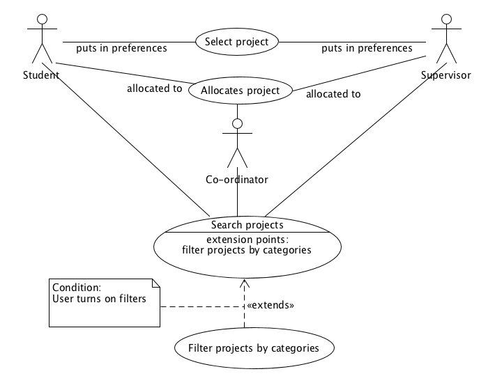

# Table of Contents

- [Introduction](#intro)
- [Use Case Diagram](#usecasediagram)
- [Use Cases](#use-cases)
    - [Student selects a project](#student-selects-project)
        - [Overview](#student-selects-project-overview)
        - [Typical Course of Events](#student-selects-project-course)
        - [Alternative Courses of Events](#student-selects-project-course-alt)
    - [Search for a Project](#search-project)
        - [Overview](#search-project-overview)
        - [Typical Course of Events](#search-project-typical)
        - [Alternative Courses of Events](#search-project-alternatives)
    - [Filter projects by categories](#filter-projects)
        - [Overview](#filter-projects-overview)
        - [Typical Course of Events](#filter-projects-typical)
        - [Alternative Courses of Events](#filter-projects-alternatives)
    - [Co-ordinator allocates members to project](#allocate-projects)
        - [Overview](#allocate-projects-overview)
        - [Typical Course of Events](#allocate-projects-typical)
        - [Alternative Courses of Events](#allocate-projects-alternatives)
    - [Students Shortlist Projects That They Want To Take](#shortlist-projects)
        - [Overview](#shortlist-projects-overview)
        - [Typical Course of Events](#shortlist-projects-typical)
        - [Alternative Courses of Events](#shortlist-projects-alternatives)
    - [Check on supervisor's profile](#check-supervisor-profile)
        - [Overview](#check-supervisor-profile-overview)
        - [Typical Course of Events](#check-supervisor-profile-typical)
    - [Search the gallery for projects](#search-gallery)
        - [Overview](#search-gallery-overview)
        - [Typical Course of Events](#search-gallery-typical)
    - [Sort projects by relevancy](#sort-projects)
        - [Overview](#sort-projects-overview)
        - [Typical Course of Events](#sort-projects-typical)
- [System Wide Requirements](#syswidereqs)
    - [Introduction](#syswideintro)
    - [System-Wide Functional Requirements](#syswidefuncreqs)
    - [System Qualities](#sysquality)
        - [Usability](#usability)
        - [Reliability](#reliability)
        - [Performance](#performance)
        - [Maintainability](#maintainability)
        - [Security](#security)
        - [Portability](#portability)
    - [System Constraints](#sysconstraints)
    - [System Documentation](#sysdocs)

# Introduction

The System Requirements Specification is meant to document all the stated and implied requirements of the end users of the system. It is meant to be updated as the project progresses and the team acquires a more thorough understanding of the users' needs.

# Use Case Diagram
This is meant to be a visual representation of the team's module and how the different requirements it must fulfill fit together.

# Use Cases

## Student selects a project

### Overview

 Attribute | Description
 --- | ---
 Use Case | A student selects a project for their thesis
 Actors | Student (initiator), Supervisors
 Purpose | Select a project for a thesis
 Overview | The use case begins when a student decides to select a project to work on for a thesis. They must select a project from a list of available projects. Once they have made their selection, the system must check for their eligibility. If eligible, the student will start working on the project and the supervisors will be notified that the project has been undertaken.
 Type | Primary
 Cross-References | Use Case: Search for projects
 Pre-conditions | Student must be logged in
 Post-conditions | The project the student selects must be marked as in-progress and be removes from the list of available projects

### Typical Course of Events

 Actor Response | System Response
 :---: | :---:
 1) This use case begins when a student decides to select a project to work on |
 2) The user searches through a list of projects, and selects the one they want to take |
  | 3) The system checks for eligibility, and allocates the student to the project if eligible.
  | 4) The system then notifies the staff associated with the project that this project has been taken
  | 5) The system marks the project as in-progress, and removes it from the list of available projects

### Alternative Courses of Events

- If the student is not logged in, they are prompted to do so before being allowed to select a project
- If the student does not meet the eligibility requirements for a project they have selected, they are informed by a message and advised to select a different project

## Search for project

### Overview

Attribute | Description
--- | ---
Use Case | Search for a project based on some criteria
Actors | User (initiator) (Can be anybody using the system)
Purpose | To find a project that meets the criteria the user has defined
Overview | This use case begins when the user decides they want to find a project that meets a certain set of criteria. They enter text that describes what they are looking for, and the system returns a list of projects that fit that description
Type | Primary
Cross-References | None
Pre-conditions | None
Post-conditions | The system must return  a project or a list of projects that meet the user-defined criteria

### Typical Course of Events

Actor Response | System Response
:---: | :---:
1) This use case begins when the user decides that they need to find a project that meets certain criteria |
2) The user types some key words or phrases that relate to the project they are looking for into a text field |
 | 3) The system looks through the stored projects, looking for the search text in each field, including the project description
 | 4) The system returns a list of projects that meet the criteria defined by the search text

### Alternative Course of Events

- If the user enters text that cannot be found within any project, the system responds with a message indicating that no projects can be found that match the criteria, and the user is asked to try again
- If the user enters text that isn't valid, i.e. a string of special characters such as '#@%', the system should display a message asking the user to provide valid text only  

## Filter projects by categories

### Overview

Attribute | Description
--- | ---
Use Case | Filter projects by categories such as domain, supervisors, etc.
Actors | User (initiator) (Can be anybody using the system)
Purpose | To filter projects to show only those that fit into certain categories
Overview | This use case begins when the user decides they want to filter projects so that only those that fit into certain categories are displayed. They can select projects that are in a certain domain or ones with a particular supervisor, and the system will respond by displaying the projects that fit into those categories
Type | Secondary
Cross-References | None
Pre-conditions | None
Post-conditions | The system must return a list of projects that fit the given categories

### Typical Course of Events

Actor Response | System Response
:---: | :---:
1) This use case begins when the user decides that they need to filter projects to show only those that fit into certain categories |
2) The user can select categories such as the domain of the project, the supervisors, chief examiners or any other staff managing the project, etc. |
 | 3) The system will filter the projects based on the selected categories, and return a list of projects that fit the selected categories

### Alternative Course of Events

- If there are no projects that fit the chosen categories, the system will display an appropriate message and ask the user to broaden the scope of the filter

## Co-ordinator allocates members to project

### Overview

Attribute | Description
--- | ---
Use Case | Co-ordinator allocates students and supervisors to projects
Actors | Co-ordinator (initiator), Students, Supervisors
Purpose | To allocate students and supervisors to projects based on their preferences and abilities
Overview | This use case begins when the Honors Co-ordinator decides to allocate students and supervisors to a project. They take their preferences, time of preference submission and abilities and relation to the project domain into account when making their decisions.
Type | Primary
Cross-references | None
Pre-conditions | Students and Supervisors must have submitted their preferences for projects
Post-conditions | Both students and supervisors must be allocated to the correct projects

### Typical Course of Events

Actor Response | System Response
:---: | :---:
1) This use case begins when the co-ordinator decides they want to allocate students and supervisors to a project |
2) They search for a project to allocate members to |
 | 3) The system gives the co-ordinator a list of students and supervisors who have listed their preferences for that project
4) The co-ordinator selects the most appropriate students and supervisors and allocates them to the project |
 | 5) The system notifies the students and supervisors that they have been allocated to that project

### Alternative Course of Events

- If no preferences have been submitted for a project by students or supervisors, the system displays an appropriate message to the co-ordinator and informs him to try again at a later date

## Students Shortlist Projects That They Want To Take

### Overview

Attribute | Description
--- | ---
Use Case | Students shortlist projects that they are interested in to be viewed later
Actors | Student (initiator)
Purpose | To allow students to save the projects that they are interested in to make it easier for them to decide which one to pick later
Overview | This use case begins when a student finds a project that they are interested in and want to consider taking up a project
Type | Primary
Cross-references | None
Pre-conditions | Students must be eligible to take the project
Post-conditions | Project is saved into that student's shortlist

### Typical Course of Events

Actor Response | System Response
:---: | :---:
1) This use case begins when the student decides to shortlist a certain project |
2) They click the shortlist button on the project page |
 | 3) The system saves that project into the student's shortlist and notifies the student

### Alternative Course of Events

- If the student is not eligible to take up the project, the system will notify the student of that case and will not save it into the student's shortlist

## Check on supervisor's profile

### Overview

Attribute | Description
--- | ---
Use Case | Check on supervisor's profile for their research areas, projects offered, projects completed, etc
Actors | User (initiator) (Can be anyone)
Purpose | To view more details about the supervisor
Overview | This use case begins when a user wants to know more about a supervisor
Type | Primary
Cross-references | None
Pre-conditions | None
Post-conditions | The selected supervisor's profile is shown to the user

### Typical Course of Events

Actor Response | System Response
:---: | :---:
1) This use case begins when the user wants to know more about a supervisor |
2) The user clicks on the supervisor's profile that he/she wants to know |
 | 3) The system loads the data of the supervisor from the database
 | 4) The system brings the user to a new page that contain the details of the supervisor

## Check on supervisor's profile

### Overview

Attribute | Description
--- | ---
Use Case | Search the gallery for previous instances of the project
Actors | User (initiator) (Can be anyone)
Purpose | To see previous or related completed projects for further information about what is expeced
Overview | This use case begins when the user wants to search for a previous instance of the project
Type | Primary
Cross-references | None
Pre-conditions | The student must be logged in and viewing the gallery
Post-conditions | None

### Typical Course of Events

Actor Response | System Response
:---: | :---:
1) This use case begins when the user wants to search for an instance of a completed projectr |
2) The user types in search query|
 | 3) The system loads instances of projects in the gallery |
4) The user selects link of interest|
 | 5) The system brings the user to the page with an instance of a completed project

 
## Sort projects

### Overview

Attribute | Description
--- | ---
Use Case | Sort the projects seen by a particular user depending on the degree they're doing
Actors | User (initiator) (Student)
Purpose | To sort project options based on relevancy
Overview | This use case begins when the user goes to the page that displays projects
Type | Primary
Cross-references | None
Pre-conditions | The student must be logged in and viewing projects page
Post-conditions | None

### Typical Course of Events

Actor Response | System Response
:---: | :---:
1) User navigates to page which displays projects |
 | 2) System sorts projects depending on what the user studies|
 | 3) System displays sorted projects

# System-Wide Requirements

## Introduction

 The system to be built is a large enterprise application used to manage honors projects for Monash University. It will consist of modules that will interact with each other through a service protocol - in other words, a service-oriented architecture. This document is meant to outline all the system-wide requirements this application must fulfill in order to meet client expectations.

## System-Wide Functional Requirements
 - Authentication: A user must be authenticated as a Monash Honors/Masters candidate or a faculty member with the prerequisite permissions before being permitted access to the system.

 - User Roles: A faculty member must have different access rights and responsibilities from those of a student. There must also be an Admin Role for the Honors Coordinator

## System Qualities

### Usability

 The quality of a user interface can be the difference between success and failure. A user should be able to connect every UI element with its purpose intuitively - they should not have to think deeply about what they are doing. The system will be designed with this tenet in mind, and make it so that the user experience is as unobtrusive as possible. The key features the system should provide are listed below:

 - The system needs to account for people with disabilities, such as color blindness
 - The system should be as simple as possible to reduce cognitive load in daily use
 - The system needs to space UI elements so that the users' attention is immediately drawn to the most important information
 - The system should utilize fonts in such a way as to increase clarity and smooth over the user experience
 - The UI elements should be consistent to help reduce the learning curve for using the system
 - The system needs to provide feedback to the user as frequently as possible to make sure they always know what to do next
 - The system should provide defaults whenever possible, such as automatically filling certain fields on a form, to reduce the work users have to do

### Reliability

 The application has a large user base, and will likely have many concurrent users at any given time. It may also be accessed at any given time of the day through a whole year. The system will also have major consequences for errors, given that it is being used to manage honors projects and that many students' final grades depend on this system. Given these requirements, it is easy to see that the application must be highly available and must handle any possible errors such that they don't affect any users adversely. The key features the system should provide are listed below:

 - The system must save all data in case of a power failure. It may also be possible to keep it running on an alternate power source, though the feasibility of this is yet to be determined.
 - They system must make daily backups of all information. These must be stored on the cloud and on local storage, with the local backups being stored in different places to avoid a single point of failure in the case of hazards such as a fire outbreak.
 - The system must be serviceable so that if, by any chance, it becomes inaccessible, staff can be called in during Monash working hours to fix it. By Esolutions' standards, this system would be classified as a Class B/C service.
 - The system should avoid having a centralized database to negate the possibility of a single point of failure
 - The system should prevent any invalid operations from being performed, and aim to preserve data integrity as a top priority

### Performance

 The system is not estimated to be particularly performance-intensive. It is going to be manipulating mainly text and numbers, and maybe a few images and videos. This does not add up to a significant overhead, so we can be relatively lax when it comes to optimization. However, we will make sure to keep the system responsive and fast enough to maintain the user experience. The key features the system should provide are listed below:

 - The system should respond quickly to user input and return results with negligible delay.
 - The system should be fluid when moving between different pages on the site.

### Maintainability

 At the moment, the system is meant to only manage honors projects for the Faculty of Information Technology. However, as the system is worked upon, ease of extensibility will be a top priority, ensuring that the system can be modified to accommodate other faculties as well. Not only that, the design is to be made so as to ensure that any functionality that is deemed necessary and is discovered after the project has been completed can be added without changing the existing code. This will allow the system to adapt to user requirements and remain relevant even years after its debut. The key features the system should provide are listed below:

 - The system classes will be designed using object-oriented design principles such as SOLID to ensure that there is low coupling between classes and to encourage reuse
 - The system packages will group related classes together to control dependencies
 - The system will utilize design patterns in appropriate situations to increase extensibility
 - The system will be split into modules that interact through a service protocol to encourage reuse and avoid having a single point of failure

### Security

 Security is essential for the system, as it will deal with sensitive information such as the details of students and faculty, as well as project information that, if leaked, would be disastrous. Ensuring that the system is protected from malicious penetration is a top priority. The measures the system should take are listed below:

 - In-depth penetration testing should be done to root out vulnerabilities within the system
 - Data input should be sanitized to protect the system against exploits such as SQL injection
 - Single sign-on and sign-off should be used for access control
 - Passwords should be hashed instead of being encrypted to avoid the possibility of hackers cracking the used cipher
 - Require authentication on every webpage of the system if not logged in
 - Update development tools when there is a security patch to avoid vulnerabilities being exposed
 - Disallow execution of scripts that are not hosted on the domain to guard against XSS attacks
 - Perform validation on both browser and server sides to prevent undesirable results
 - Inspect uploaded files to make sure they are not malicious
 - Use HTTPS to communicate securely
 - Perform automated security testing using security tools such as OpenVAS

### Portability
 Since our target audience for the system are students/supervisors/honors coordinators, they will be expected to be working on different devices at different times hence, our system should be required to be able to support itself on multiple platforms.

 - Users should be able to use our system on any Web Browser (min: Microsoft Edge, Safari, Google Chrome, Firefox)
 - Users should be able to use our system on any Operating System (min: MacOS, Windows, Linux)
 - System should be mobile friendly, allowing easy use for smartphone/tablet users

## System Constraints

 There aren't too many constraints on the development of the system. The languages and frameworks to be used were largely left up to the development team, with the caveat that if we wanted ESolutions to be able to manage the system, we'd have to use one of the following languages - Javascript, PHP, Java or C#.

 The final couple of constraints are that the system has to be hosted on the cloud (therefore we need to keep hosting and cloud platform service costs in mind while developing the system) and that it needs to have a service-oriented architecture that has its modules interacting with each other through a service protocol.

## System Documentation

 Each team will be working on its own individual module, and API documentation will need to be created for each module for communication and integration between the individual modules.

 Each team member will be expected to create documentation for the tasks that they will be working on. Creating documentation is expected to be a process that is integrated into the development workflow - it should not be delegated to the end of the project lifecycle.

 Class-level and method-level documentation are the minimum requirements. Any complex algorithms used must be explained clearly enough that developers not experienced with them can understand the concepts behind them and be able to find resources for more in-depth understanding with ease.

 The API documentation must be easily understandable by the other teams involved, and vice versa for their modules' API docs. It should be extensive enough that teams can figure out how to use the fundamental functionality of the modules with a moderately thorough scan of the documentation - teams should not feel the need to bombard the developers of a module with a barrage of questions about its interface.
